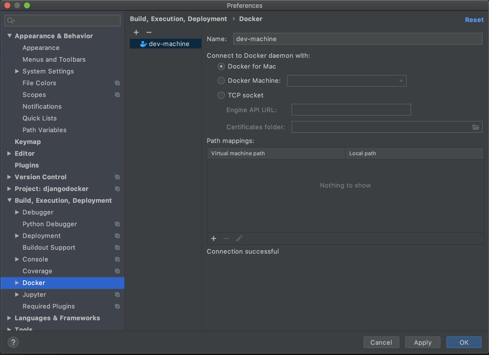
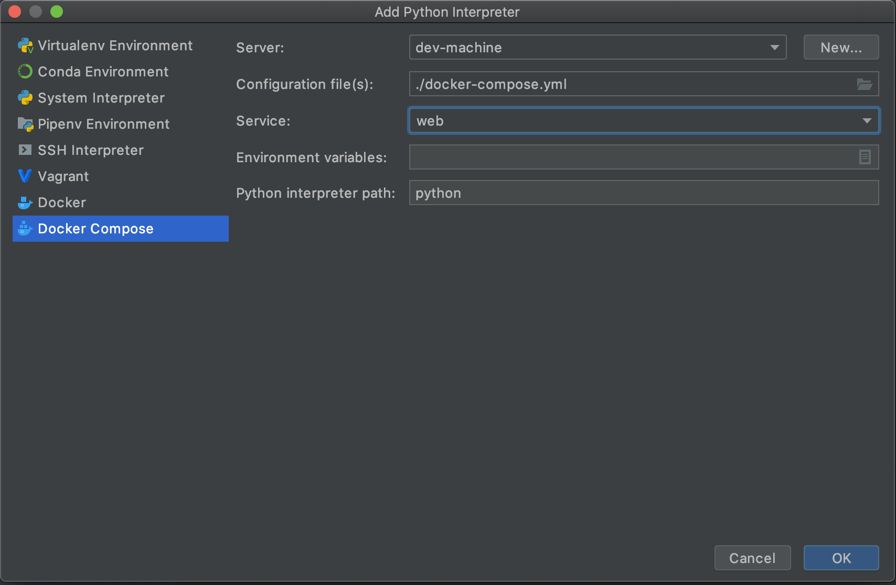
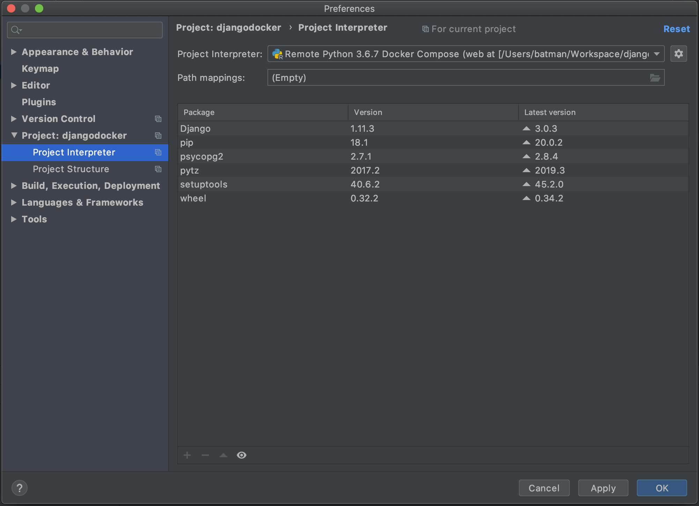
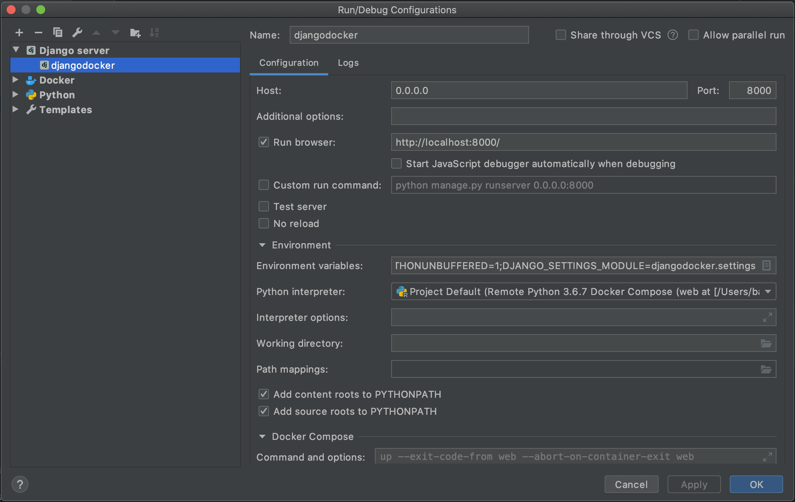
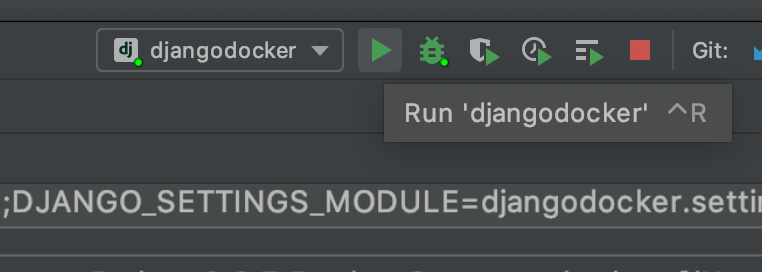
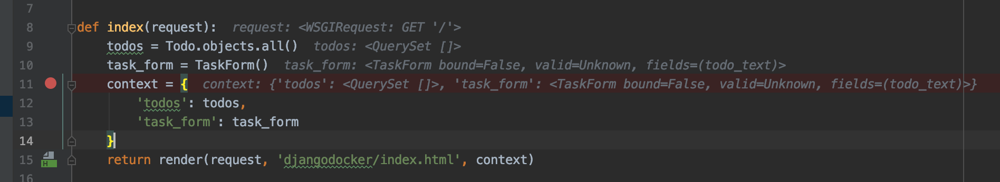
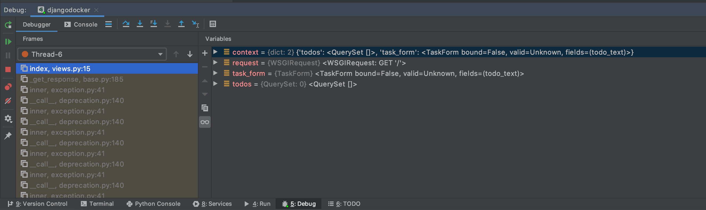

Django Todo App in Docker
=========================

This is an example project for a 
[blog post on the PyCharm blog](http://blog.jetbrains.com/pycharm/2017/08/using-docker-compose-on-windows-in-pycharm).
Please read more about it there.

To run the project, set up a Django compatible database (I use PostgreSQL but you're welcome to use something else)
and configure it in `djangodocker/settings.py`. 

## Setting up docker-compose with Pycharm
1. Build the prerequisite base docker image `docker build -t "base-image" .`
2. Goto, Preferences -> Build, Exectuion, Deploy -> Docker. Create docker server, which will be used to test deployment.

3. Preferences -> Project: -> Project Interpreter -> [Gear option, Add] -> Docker Compose.

4. Post selection, list of available package will be visible.

5. Setting up Django db, `docker-compose run web python manage.py migrate`
6. Setting up Run configuration, Run -> Edit Configuration

7. Use default Pycharm's run and debug options

## Useful commands
1. Kill all running containers `docker container kill $(docker ps -q)`
2. Stop and clean, `docker compose down`